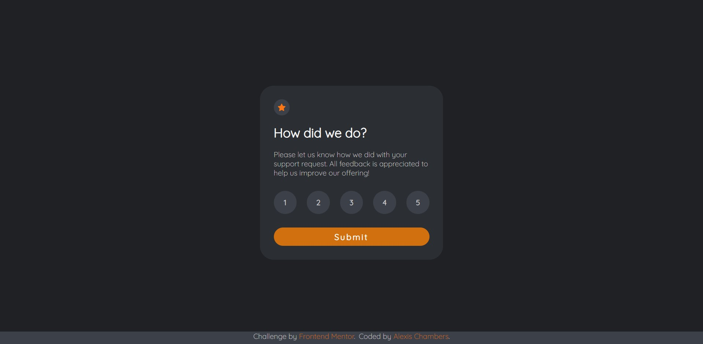

# Frontend Mentor - Interactive rating component solution

This is a solution to the [Interactive rating component challenge on Frontend Mentor](https://www.frontendmentor.io/challenges/interactive-rating-component-koxpeBUmI). Frontend Mentor challenges help you improve your coding skills by building realistic projects. 

## Table of contents

- [Overview](#overview)
  - [The challenge](#the-challenge)
  - [Screenshot](#screenshot)
  - [Links](#links)
- [My process](#my-process)
  - [Built with](#built-with)
  - [What I learned](#what-i-learned)
  - [Continued development](#continued-development)
- [Author](#author)

**Note: Delete this note and update the table of contents based on what sections you keep.**

## Overview

### The challenge

Users should be able to:

- View the optimal layout for the app depending on their device's screen size
- See hover states for all interactive elements on the page
- Select and submit a number rating
- See the "Thank you" card state after submitting a rating

### Screenshot

### Links

- Solution URL: https://github.com/kowai-onigiri/Interactive-Rating-final
- Live Site URL: https://kowai-onigiri.github.io/Interactive-Rating-final/

## My process

### Built with

- Semantic HTML5 markup
- CSS custom properties
- Flexbox
- Mobile first
- JS DOM manipulation

### What I learned

- Mobile first design
- Responsive techniques
- DOM manipulation

### Continued development

- fix issue where user can select multiple ratings, resulting in incorrect rating result (i.e. user selects '2', '4', and '1' and the rating result shows '... selected 241 out of 5')

## Author

- Frontend Mentor - [@kowai-onigiri](https://www.frontendmentor.io/profile/kowai-onigiri)

